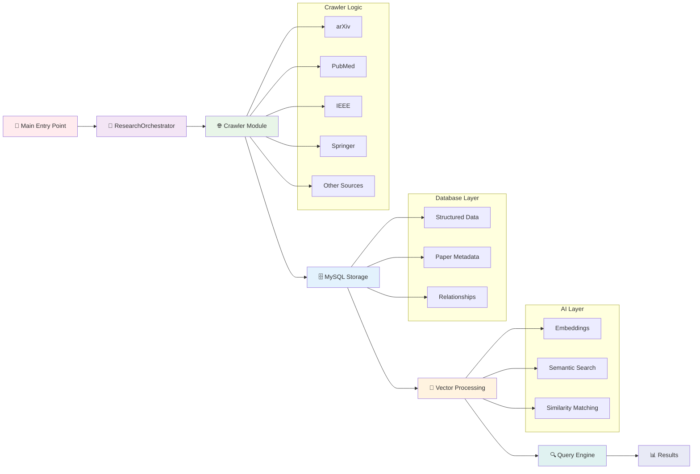

# 🧠 Intelli_Research

**Intelli_Research** is a Python-based research paper aggregation and management platform that automatically crawls multiple scientific websites, stores the collected data in a **MySQL database**, and creates a **vector database (ChromaDB)** for intelligent semantic search across the papers.

---

## 🚀 Features

- 🔎 **Multi-source Web Crawler**  
  Automatically scrapes research papers from **10 major platforms**:
  - arXiv  
  - BioRxiv  
  - DBLP  
  - DOAJ  
  - IEEE Xplore  
  - OpenAlex (API-based)  
  - PubMed  
  - ScienceDirect  
  - Springer  

- 🧩 **MySQL Database Integration**  
  - Creates and manages an `articles` table.  
  - Supports automatic clearing, inserting, and storing of crawled papers.  

- 💬 **Vector Database (ChromaDB)**  
  - Embeds paper titles using **SentenceTransformer (all-MiniLM-L6-v2)**.  
  - Enables **semantic search** to find conceptually similar papers.  

- 🧠 **Orchestrator Class (ResearchOrchestrator)**  
  - Runs the full pipeline: **crawl → store in MySQL → embed in ChromaDB → search**  
  - Optional saving of results to text files.  

---

## 🏗️ Project Structure



## ⚙️ Installation & Setup

Follow these steps to set up and run the Intelli_Research project on your system.

---

### 🧩 1️⃣ Clone the Repository
Clone this repository from GitHub and navigate into the project folder:
```bash
git clone https://github.com/KetanGupta45-1/Intelli_Research.git
cd Intelli_Research
```


### 💻 2️⃣ Create a Virtual Environment
Windows :
```bash
python -m venv venv
venv\Scripts\activate
```

Mac:
```bash
python3 -m venv venv
source venv/bin/activate
```


### 📦 3️⃣ Install Dependencies
```bash
pip install -r requirements.txt
```

### 🛢️ 4️⃣ Configure MySQL Connection
Edit the file MySQL_Database/db_config.py as follows
```bash
db_config = {
    "host": "localhost",
    "user": "root",
    "password": "YOUR_PASSWORD",
    "database": "Intelli_Research_Project"
}
```

### 🚀 5️⃣ Run the Pipeline
```bash
from ResearchClass import ResearchOrchestrator

# Initialize and run the orchestrator
research = ResearchOrchestrator(topic="Deep Learning in Healthcare", max_papers=10)
research.run_pipeline(search_query="diabetes prediction", top_k=5, clear_before_push=True)

```
